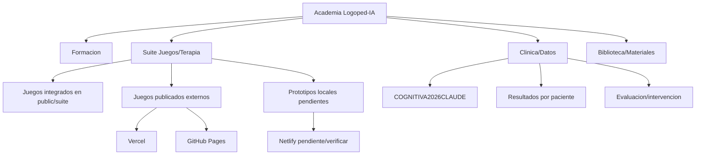

# Mapa Academia + Suite de Juegos Logoped-IA

Fecha de inventario: 2026-06-23  
Ventana revisada: febrero 2026 a junio 2026  
Fuentes revisadas: local, GitHub, Vercel local/remoto por URL publica, rastros Netlify.

## Resumen ejecutivo

La academia viva es:

- Local: `/Users/joseaserraf/Desktop/ACADEMIA MEMBRESIA LOGOPED-IA DESDE CENTRO`
- Vercel: https://academia-logoped-ia.vercel.app
- GitHub relacionado: https://github.com/foniafonia/academia-logoped-ia

La academia ya tiene ruta privada `/suite` y un `public/suite`, pero ahora mismo solo integra una parte pequena del universo de juegos:

- Dentro de academia/public/suite: Letra Crush, Encuentra el Nuevo, Lupas y Linternas, LetraBlaster Demo, LetraPang Demo, LectoViva como enlace externo.
- Fuera de academia pero vivo en Vercel/GitHub/local: FonoMundos, Sónica, Kig & Find, Conciencia Fonológica, Constructor de Sílabas en el Aire, Puzzle Agarre, Lengua Runner, FonoMesa Lab, FonoMundos WOW, COGNITIVA2026CLAUDE y muchos prototipos Poe/febrero-marzo.

## Visual de arquitectura recomendada



## Leyenda

- Integrado: ya vive dentro de `ACADEMIA.../public` o se muestra en `/suite`.
- Publicado: tiene URL publica verificada o repo remoto claro.
- Local: encontrado como archivo/proyecto local sin integracion actual.
- Prioridad 1: meter ya para tener control visual.
- Prioridad 2: meter como ficha/enlace y decidir despues.
- Prioridad 3: conservar en cajon/backlog.

## Estado por hosting/repositorio

| Capa | Estado | Hallazgos |
| --- | --- | --- |
| GitHub | Acceso OK como `foniafonia` | Repos relevantes: `fonomundos`, `academia-logoped-ia`, `sonica-runner`, `vocalclinic-demo`, `lectoviva-v2`, `logopedia-generador`, `araia`, `adapro-plus`, `logoped-ia-examen`, `radar-clinico-digital`, `logoped-ia-tools`, `curso-logoped-ia`. |
| Vercel | URLs publicas verificadas con 200 | `academia-logoped-ia`, `fonomundos`, `sonica-runner`, `kig-find-interactivo`, `conciencia-fonologica-lexica-juego`, `constructor-silabas-aire`, `puzzle-agarre-aire`, `logopedizado-gestos-juego`, `fonomesa-lab`, `foniawatch-rehab-demo`, `fonomundos-wow-public`, `logoped-web`, `logoped-api-v2`. |
| Netlify | Sin CLI ni token activo | Solo se encontro `netlify.toml` en `/Users/joseaserraf/Documents/New project 5/repo`. Remoto Netlify no verificable desde esta sesion. |
| Academia local | Parcial | Tiene `public/suite`, `public/beta-innovadores`, `public/prompts-actualizados-2026`, pero no contiene aun el grueso de juegos nuevos. |

## Ya integrado en la academia

| Area | Nombre | Estado | Ruta/URL | Prioridad |
| --- | --- | --- | --- | --- |
| Lectoescritura | Letra Crush | Integrado | `/public/suite/POE/letra-crush/index.html` | Mantener |
| Fonologia | Encuentra el Nuevo | Integrado | `/public/suite/POE/encuentra-el-nuevo/index.html` | Mantener |
| Atencion visual | Lupas y Linternas / Detective de Palabras | Integrado | `/public/suite/POE/lupas y linternas/index.html` | Mantener |
| Lectoescritura | LetraBlaster Demo | Integrado demo | `/public/suite/POE/letrablaster-demo/index.html` | Revisar |
| Lectoescritura | LetraPang Demo | Integrado demo | `/public/suite/POE/letrapang-demo/index.html` | Revisar |
| Lectoescritura | LectoViva v2 | Enlace externo | https://foniafonia.github.io/lectoviva-v2/ | Mantener/enlazar mejor |
| Beta innovadores | Praxias Connect | Integrado en public, no claro en suite | `/public/beta-innovadores/praxias-connect.html` | 2 |
| Beta innovadores | Alfabeto PNL | Integrado en public, no claro en suite | `/public/beta-innovadores/alfabeto-pnl.html` | 2 |
| Beta innovadores | Myosinc | Integrado en public, no claro en suite | `/public/beta-innovadores/myosinc.html` | 3 |

## Prioridad 1: meter ya en la visual de academia

| Area | Nombre | Estado remoto/local | Ruta/URL | Nota |
| --- | --- | --- | --- | --- |
| Plataforma clinica | COGNITIVA2026CLAUDE | Local | `/Users/joseaserraf/Documents/New project 6/COGNITIVA2026CLAUDE/index.html` | PIN, pacientes, sesiones, resultados y 16 talleres. Debe entrar como "Clinica/Datos". |
| Conciencia fonologica | FonoMundos | GitHub + Vercel | https://fonomundos.vercel.app / https://github.com/foniafonia/fonomundos | Plataforma principal; incluir tambien sus subentradas. |
| Conciencia fonologica | FonoMundos Modo Historia | Public/local separado | `/Users/joseaserraf/Desktop/TODO PROYECTO LOGOPED IA VICTOR Y DEMAS/fonomundos/public/modo-historia.html` | Es entrada separada del FonoMundos principal. |
| Conciencia fonologica | FonoMundo Bosque | Public/local separado | `/Users/joseaserraf/Desktop/TODO PROYECTO LOGOPED IA VICTOR Y DEMAS/fonomundos/public/fonomundo-bosque/index.html` | Juego/mundo especifico. |
| Gestos/camara | Constructor de silabas en el aire | Vercel 200 | https://constructor-silabas-aire.vercel.app | Prototipo reciente, muy diferencial. |
| Gestos/camara | Puzzle agarre en el aire | Vercel 200 | https://puzzle-agarre-aire.vercel.app | Camara + fallback tactil. |
| Gestos/camara | Lengua Runner | Vercel 200 | https://logopedizado-gestos-juego.vercel.app | Juego por gestos, necesita categoria propia. |
| Atencion visual | Kig & Find interactivo | Vercel 200 | https://kig-find-interactivo.vercel.app | Atencion visual + lenguaje. |
| Fonologia/lectura | Conciencia fonologica lexica juego | Vercel 200 | https://conciencia-fonologica-lexica-juego.vercel.app | Entrada independiente. |
| Fisico-digital | FonoMesa Lab | Vercel 200 | https://fonomesa-lab.vercel.app | Laboratorio con mando movil, QR, eventos. |
| Runner auditivo | Sonica Runner | GitHub privado + Vercel 200 | https://sonica-runner.vercel.app / repo `sonica-runner` | Runner 3D de discriminacion auditiva. |
| Voz/rehab | FoniaWatch Rehab Demo | Vercel 200 | https://foniawatch-rehab-demo.vercel.app | Parte de VocalClinic/FoniaWatch. |
| Lectoescritura | FonoSuika v9 | Local | `/Users/joseaserraf/Downloads/fonosuika_v9/index.html` | Comparar con v9.1; probablemente esta es la buena. |

## Prioridad 2: juegos/prototipos que conviene registrar

| Area | Nombre | Estado | Ruta/URL |
| --- | --- | --- | --- |
| Lectoescritura | KABOOM Lectoescritura Premium | Local | `/Users/joseaserraf/Desktop/TODO PROYECTO LOGOPED IA VICTOR Y DEMAS DESDE CENTRO/POE/kaboom-lectoescritura-premium/index.html` |
| Lectoescritura | KABOOM base | Local | `/Users/joseaserraf/Desktop/TODO PROYECTO LOGOPED IA VICTOR Y DEMAS DESDE CENTRO/KABOOM_LECTOESCRITURA/index.html` |
| Lectoescritura | LetraKart MK64 | Local | `/Users/joseaserraf/Desktop/TODO PROYECTO LOGOPED IA VICTOR Y DEMAS DESDE CENTRO/letrakart.html` |
| Lectoescritura | LetraPang completo | Local | `/Users/joseaserraf/Desktop/TODO PROYECTO LOGOPED IA VICTOR Y DEMAS DESDE CENTRO/letrapang.html` |
| Audicion | Auditory Run Pro v2 | Local | `/Users/joseaserraf/Desktop/TODO PROYECTO LOGOPED IA VICTOR Y DEMAS DESDE CENTRO/auditory-run-pro-v2.html` |
| Articulacion | Erre que Erre MVP | Local | `/Users/joseaserraf/Desktop/TODO PROYECTO LOGOPED IA VICTOR Y DEMAS DESDE CENTRO/mvp-erre-que-erre/index.html` |
| Articulacion | Aprende la R preview | Local | `/Users/joseaserraf/Desktop/TODO PROYECTO LOGOPED IA VICTOR Y DEMAS DESDE CENTRO/capturas de video/erre-preview.html` |
| Morfosintaxis | Querer Quest | Ya en suite antigua | `/Users/joseaserraf/Desktop/Logoped-IA Suite Membresia/POE/verbo-querer-quest/index.html` |
| Voz/fluidez | TerapiaFlu / Karaoke tartamudez | Ya en suite antigua | `/Users/joseaserraf/Desktop/Logoped-IA Suite Membresia/POE/karaoke-tartamudez/index.html` |
| Voz | S/Z | Ya en suite antigua | `/Users/joseaserraf/Desktop/Logoped-IA Suite Membresia/POE/s-y-z/index.html` |
| Articulacion | Nave de la erre / 194RRR | Ya en suite antigua | `/Users/joseaserraf/Desktop/Logoped-IA Suite Membresia/POE/194RRR/index.html` |
| Atencion | DonkeyFon | Ya en suite antigua | `/Users/joseaserraf/Desktop/Logoped-IA Suite Membresia/POE/donkeyfon/index.html` |
| SAAC | Tablero PECS | Local | `/Users/joseaserraf/Desktop/TODO PROYECTO LOGOPED IA VICTOR Y DEMAS/prototipos-saac-arasaac-pecs/tablero-pecs.html` |
| SAAC | Secuenciador visual | Local | `/Users/joseaserraf/Desktop/TODO PROYECTO LOGOPED IA VICTOR Y DEMAS/prototipos-saac-arasaac-pecs/secuenciador-visual.html` |
| SAAC | Banco pictogramas | Local | `/Users/joseaserraf/Desktop/TODO PROYECTO LOGOPED IA VICTOR Y DEMAS/prototipos-saac-arasaac-pecs/banco-pictogramas.html` |
| TEACCH | Lleno/Vacio | GitHub + local | https://github.com/foniafonia/lleno-vacio-teacch |
| Lectura/dislexia | Adapro Plus / LectoViva | GitHub + local | https://github.com/foniafonia/adapro-plus |
| Materiales | Logopedia Generador | GitHub + local | https://github.com/foniafonia/logopedia-generador |
| Evaluacion | Logoped-IA Examen | GitHub + local | https://github.com/foniafonia/logoped-ia-examen |
| Clinica | Radar Clinico Digital | GitHub + local | https://github.com/foniafonia/radar-clinico-digital |
| Voz | VocalClinic Demo | GitHub + Vercel relacionado | https://github.com/foniafonia/vocalclinic-demo |

## Prioridad 3: Poe masivo y cajon de prototipos

Estos deben aparecer como fichas "sin normalizar" para no perderlos, pero no son lo primero para producto:

- Bingo educativo
- Pac-Man Logopedia
- Kaboom Poe
- Auditory Run Pro Poe
- Ruleta Morfosintaxis
- Morfosintaxis Videojuego
- Logopedia Domino Juego
- Sílaba UNO
- Slot Educativo Premium
- Erre S Pro
- DiagnostIA Pro
- Evaluacion Logopedica App
- Taller Voz
- Sistema Entrenamiento Vocal
- Karaoke ritmo
- Juego Visual
- Psicomotricidad
- Codigo Habilidades Sociales
- Evaluacion Social
- Diario Logopeda
- ClinicPro HTML
- Visualizador Onda Audio
- PDF Interactivo
- Guia Familiar Rutinas
- Templo Logopedia
- Juderia/Barrio Melilla juegos

Carpeta principal:

- `/Users/joseaserraf/Desktop/poe masivo`

## Netlify

Netlify queda pendiente de auditoria remota. Hallazgos actuales:

- No hay `netlify` CLI instalada en esta maquina.
- No hay `NETLIFY_AUTH_TOKEN` ni `NETLIFY_SITE_ID` en el entorno.
- No existe `/Users/joseaserraf/.netlify/config.json`.
- Se encontro un unico `netlify.toml`:
  - `/Users/joseaserraf/Documents/New project 5/repo/netlify.toml`
  - Build: `pnpm install && pnpm run build`
  - Publish: `artifacts/logoped-ia/dist/public`
  - Functions: `artifacts/api-server/netlify/functions`

Conclusion: hay preparacion local para Netlify en `New project 5/repo`, pero no se pudo comprobar sitio/deploy remoto Netlify desde esta sesion.

## Decision practica para empezar academia

### Paso 1: crear tablero visible en academia

Crear en la academia una vista tipo "Mapa de Suite" con columnas:

- Integrado
- Publicado externo
- Local pendiente
- Cajon desastre

### Paso 2: no copiar todo al principio

Para empezar rapido, conviene meter como enlaces/fichas:

1. FonoMundos
2. FonoMundos Modo Historia
3. FonoMundo Bosque
4. COGNITIVA2026CLAUDE
5. Constructor Silabas Aire
6. Puzzle Agarre Aire
7. Lengua Runner
8. Kig & Find
9. FonoMesa Lab
10. Sonica Runner
11. FonoSuika

### Paso 3: normalizar despues

Cuando ya este todo visible, cada juego deberia tener:

- `id`
- `titulo`
- `area`
- `estado`
- `origen`
- `url_publica`
- `ruta_local`
- `repo`
- `hosting`
- `tiene_resultados`
- `necesita_camara`
- `prioridad`

## Campos sugeridos para el catalogo

```ts
type SuiteItem = {
  id: string
  titulo: string
  area: 'lectoescritura' | 'fonologia' | 'voz' | 'morfosintaxis' | 'saac' | 'clinica' | 'formacion' | 'cajon'
  estado: 'integrado' | 'publicado' | 'local' | 'pendiente' | 'duplicado'
  prioridad: 1 | 2 | 3
  urlPublica?: string
  rutaLocal?: string
  repo?: string
  hosting?: 'vercel' | 'github-pages' | 'netlify' | 'local' | 'desconocido'
  requiereCamara?: boolean
  tieneResultados?: boolean
  notas?: string
}
```

